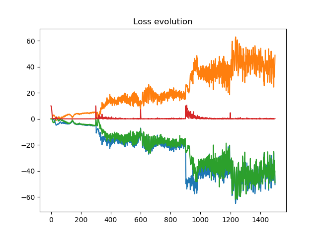

# Progressive WGAN with gradient penalty

For this personal project I implement a progressive growing WGAN, the one described in the paper from NVidia : https://arxiv.org/abs/1710.10196  
The tensorflow 2.0 version is working but I am still working on the "equalized learning rate" feature.  
The tensorflow 1.14 version is not working yet, it lacks the management of the introduction of new blocks inside the training (Just have to make alpha shift from 0 to 1 for the growing phases). Plus, the management of the "equalized learning rate" feature still has some problem as it makes the weights go to 0, ruining the training. 

# Results so far with the 2.0 version on mnist dataset:
<b>1st phase</b>: We generate 7x7 images 

 <b>2nd phase</b>: We make the transition from 7x7 to 14x14 images 

 <b>3rd phase</b>: We generate 14x14 images 

 <b>4th phase</b>: We make the transition from 14x14 to 28x28 images 

 <b>5th phase</b>: We generate 28x28 images 

  And finally, let's analyze the loss function to see what is wrong with this progressive Gan: 

 In red the gradient penalty, in green the generator loss, in orange the critic loss on fake batch, in blue the critic loss on true batch. 
We directly see that the main problem here is that the generator outperform the critic, leading to poor quality images. This problem can be easily resolved by adding convolutional layers into the critic blocks, but it will create more weights to train, and my poor computer cannot make it. Moreover, the "equalized learning rate" feature could be capable of solving this problem, but first I have to implement it.
